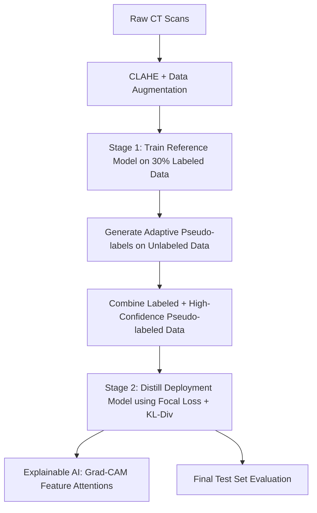

# Semi-Supervised Knowledge Distillation with CBAM for COVID-19 Detection

This repository contains a state-of-the-art Deep Learning pipeline for detecting COVID-19 from Chest CT Scan images using a Semi-Supervised Knowledge Distillation framework combined with CBAM attention.

## 🚀 Key Research Contributions

1. **Enhanced Data Preprocessing**:
   - Contrast Limited Adaptive Histogram Equalization (**CLAHE**) is applied to CT scan slices to enhance local image contrast.
   - Augmentations include random rotations, horizontal flips, and brightness/contrast adjustments (`ColorJitter`).

2. **Advanced Architectures**:
   - **Reference Model (Teacher)**: `EfficientNetV2-M` with **CBAM (Convolutional Block Attention Module)** inserted after the feature extractor.
   - **Deployment Model (Student)**: `EfficientNetV2-S` with **CBAM** inserted after the feature extractor.
   - **CBAM Module**: Combines Channel Attention and Spatial Attention mechanisms to focus on critical lesion areas in CT slices.

3. **Adaptive Pseudo-Labeling Strategy**:
   - Instead of a fixed confidence threshold, the framework uses an **Adaptive Confidence Threshold** during deployment model training.
   - Threshold schedule: starts at **`0.95`** (epochs 1-10), drops to **`0.90`** (epochs 11-20), and finalizes at **`0.85`** (epochs 21-30).
   - Only high-confidence pseudo-labels exceeding the active threshold are merged into the training pool.

4. **Robust Optimization**:
   - **Focal Loss** is utilized to handle class imbalance (COVID vs. non-COVID).
   - **Total Distillation Loss**: Combined using $\alpha \cdot \text{Focal Loss} + (1-\alpha) \cdot T^2 \cdot \text{KL-Divergence}$.
   - Optimized using **AdamW** and scheduled using a **CosineAnnealingLR** learning rate scheduler.

5. **Explainable AI (XAI)**:
   - Multi-scale **Grad-CAM** visual explanations targeting the deep feature maps of the Deployment Model.

---

## 📂 Project Pipeline



---

## 📊 Dataset Structure
The dataset directory should follow the `ImageFolder` structure:
```text
sarscov2-ctscan-dataset/
├── COVID/
│   ├── Covid (1).png
│   └── ...
└── non-COVID/
    ├── Non-Covid (1).png
    └── ...
```

---

## 🛠️ Installation & Requirements
Run the following inside your notebook environment to install the explainability and auxiliary libraries:
```bash
pip install -q timm torchinfo albumentations grad-cam
```

---

## 📈 Evaluation Outputs
The pipeline automatically generates:
- **Metrics**: Accuracy, Precision, Recall, Specificity, F1-Score.
- **Plots**: Training/Validation Loss & Accuracy history curves.
- **Visualizations**: Confusion Matrix, ROC-AUC Curves, and publication-quality Grad-CAM heatmaps/overlays.
